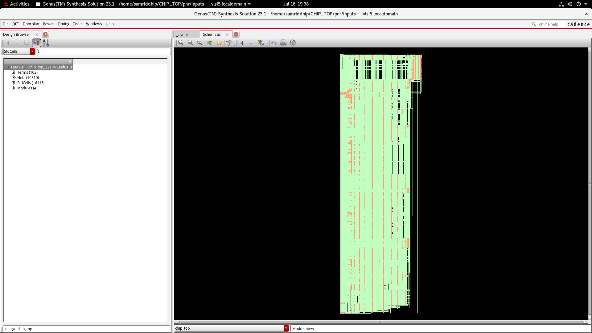
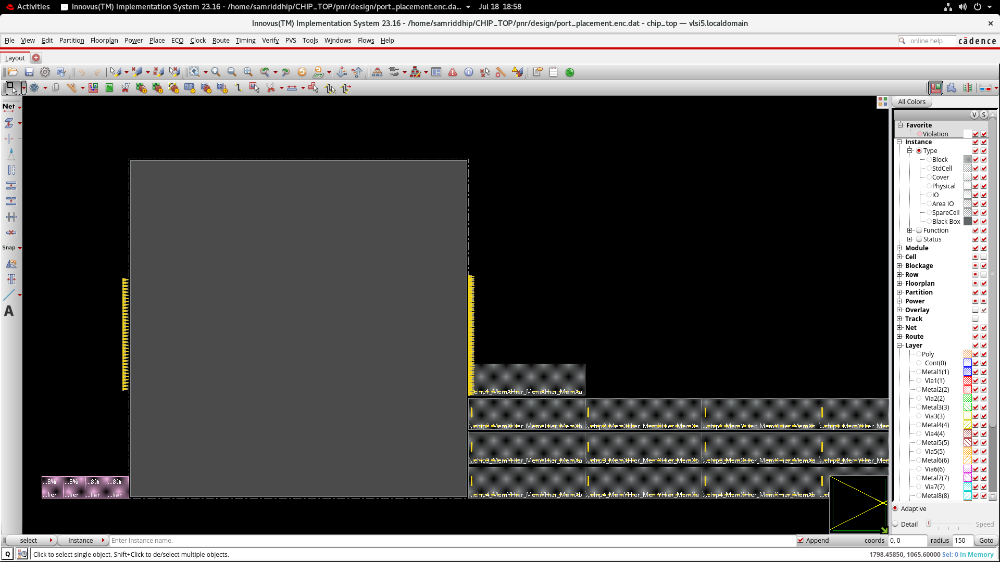
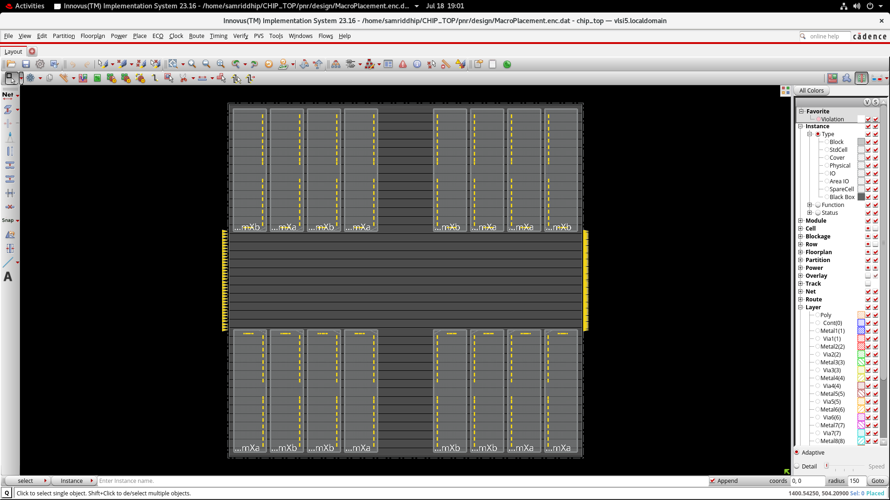
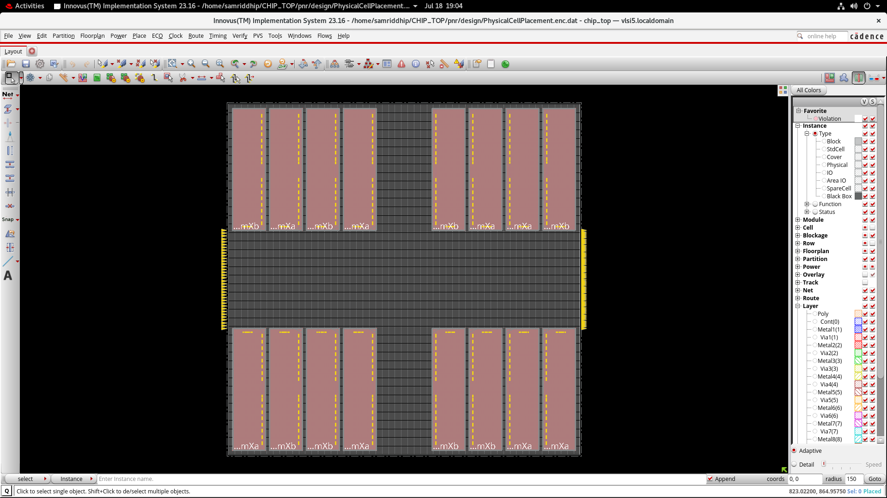
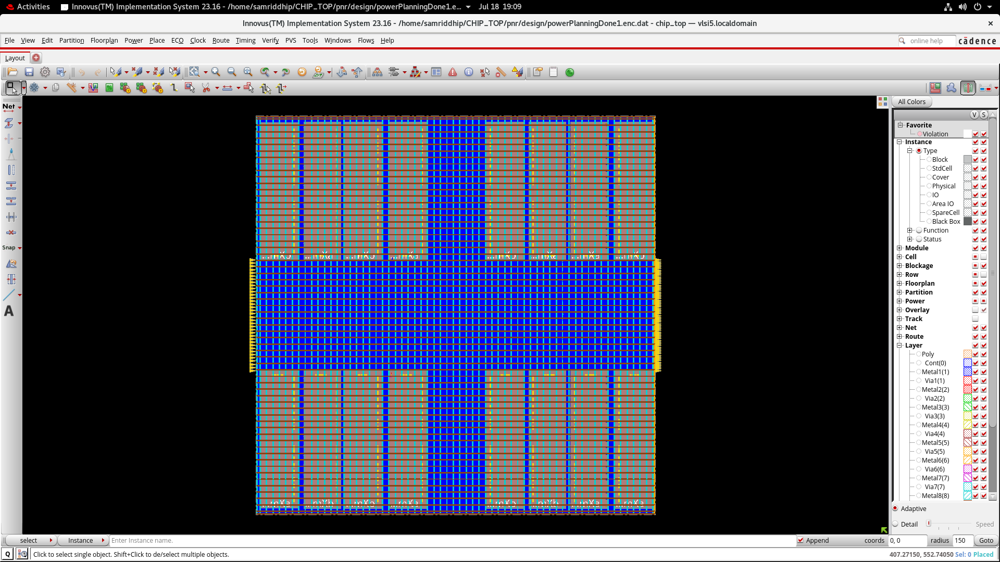
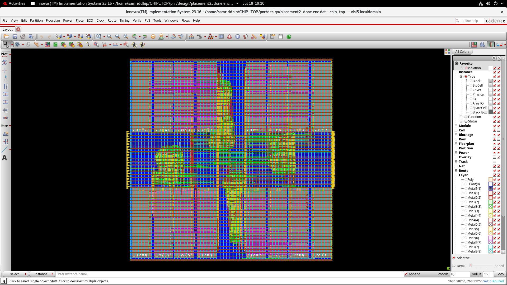
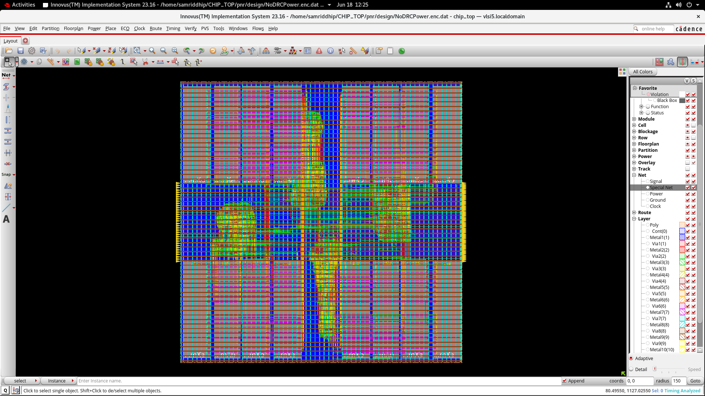

<div align="center">

# ⚡ CHIPTOP
### A Multi-Core SoC, Taken From RTL to a Signed-Off, Hold-Clean Layout

**Built during a Physical Design Internship at VLSIMINDS · Cadence Innovus 23.16 · June–July 2026**


</div>

---

## 🚀 The 30-Second Pitch

Somewhere between a blank floorplan and a finished chip, **16 memory macros**, **22,104 standard cells**, and **16,810 nets** have to agree on exactly when every signal arrives — down to the picosecond. `CHIPTOP` is that agreement, reached.

This repository documents the complete **RTL-to-GDSII physical design closure** of `chip_top` — a quad-core SoC where four identical compute clusters (`sub_chip1`–`sub_chip4`) each carry their own multiplier, instruction decoder, power controller, and dual memory macros. Every screenshot and report in here is a real artifact pulled straight out of Cadence Innovus during the build — floorplan to final signoff, nothing staged.

> **Why it matters:** a design this size lives or dies on hold timing. Get it wrong and the chip races itself into a data race before it even sees silicon. Get it right — as this one does, at **~0 ps worst hold slack across every clock domain** — and you have a chip that works the first time.

---

## 🧩 What's Actually Inside `chip_top`

```
                        ┌─────────────────────────────────────┐
                        │              chip_top                │
                        │  103 top-level ports · 16,810 nets   │
                        └───────────────┬───────────────────────┘
             ┌──────────────┬───────────┼───────────┬──────────────┐
             ▼              ▼           ▼           ▼              ▼
        sub_chip1      sub_chip2   sub_chip3    sub_chip4      (power_ack,
             │              │           │           │           MemOverflow,
   ┌─────────┼─────────┐    │  (× identical for all 4 cores)     cs[1:0])
   ▼         ▼         ▼
Mult_32x32 InstDecode PwrCtrl
   ▼                              ▼
MemXHier (MemXa + MemXb)     MemYHier (MemYa + MemYb)
   └── 2× MEM1_256X32 macros ──┘  └── 2× MEM1_256X32 macros ──┘
```

- **4× replicated compute clusters**, each with a 32×32 multiplier, instruction decode, power-state controller, and two memory hierarchies
- **16 hard memory macros** (`MEM1_256X32`) — 4 per sub-chip — driving the floorplan's macro-placement strategy
- **70 unique standard-cell types** from an LVT low-power library (AOI/OAI complex gates, scan-capable `SDFFQX1LVT` flops, clock-gating cells)
- A **global clock (`mclk`)** fanning out to **2,856 sequential loads** — the single hardest net in the design to close

---

## 🎬 The Build, Stage by Stage

Every stage below is backed by a live Innovus screenshot from the actual `.enc.dat` checkpoint saved after that step.

### 1 · Synthesis Hand-off — Genus → Innovus
`chip_top` arrives from Cadence Genus as a gate-level netlist: **22,104 leaf cells**, **16,116 standard-cell instances**, **16,810 nets**, and **103 top-level terminals**, organized under 4 hierarchical modules.



*Design Browser confirming the synthesized hierarchy before a single cell has been placed.*

### 2 · Port & Macro Placement
The four `MemXHier`/`MemYHier` memory clusters are pulled to the floorplan edges first — placing macros before standard cells is what keeps routing congestion from ambushing you three stages later.



*Early floorplan: I/O ports ringing the die, with the first macro block staged bottom-left.*

### 3 · Macro Placement — All 16 Memories Locked In
All 16 `MEM1_256X32` macros land in their final positions — 8 along the top edge, 8 along the bottom, split symmetrically across the two power domains.



*The macro-only floorplan — the skeleton every other stage builds around.*

### 4 · Physical Cell Placement
With macros anchored, the placement engine drops in the standard-cell fabric around them.



*Macros now shown solid, confirming clean placement with no overlaps ahead of power planning.*

### 5 · Power Planning
A power grid is woven across the entire core — mesh straps on the upper metal layers feeding every row, every macro, every corner of the die.



*Full power mesh (VDD/VSS) laid down before a single signal net is routed.*

### 6 · Placement Optimization
Standard cells legalize into rows and get optimized for timing and congestion — the design's first fully-populated, pre-CTS placement.



*16,116 standard cells, legalized and optimized — the calm before clock tree synthesis.*

### 7 · Final Signoff Layout
Clock tree synthesized, everything routed, timing analyzed. This is the finish line: a **DRC-clean, hold-clean, fully routed** `chip_top`.



*The completed layout — every net routed, every macro powered, every clock pin reached.*

---

## 🔬 Verification: Does It Actually Hold Up?

Pretty layouts are cheap. Clean reports are not. Here's what the checkers actually said.

### Netlist Integrity — `checkDesign -netlist`

| Check | Result |
|---|---|
| Floating ports | **0** ✅ |
| Ports connected to multiple pads | **0** ✅ |
| Nets with multiple/tri-state drivers | **0** ✅ |
| Nets with no driver | **0** ✅ |
| Output pins shorted to power/ground | **0** ✅ |
| Instances with tied input pins | 3 (`n_27` — intentional, on `g193963–g193965`) |
| Floating instance terminals | 16 (all `TieHi` on unused memory `CE` pins — benign) |
| High fan-out nets (>50 loads) | 7, incl. `clock` (2,856 loads) and `reset` (178 loads) |
| "Don't-use" cells present | `MEM1_256X32` — expected; it's the hard macro, not a synthesis cell |

### Physical Library Integrity — `checkDesign -physicalLibrary`

| Check | Result |
|---|---|
| Cells with missing LEF | **0** ✅ |
| Cells with missing PG pin | 2 flagged (`SDFF4RX1`, `SDFF4RX2` — unused in final netlist) |
| Cell dimension not a site multiple | 1 (`BUFX2`) |
| Block cells not covered by obstruction | 1 (`MEM1_256X32`) |

### Pre-CTS Design Rules

| Rule | Result |
|---|---|
| Max transition violations | **0** ✅ |
| Max fanout violations | 9 flagged → 8 real, resolved during CTS buffering; 1 was the raw `clock` net itself (expected pre-buffering) |

### Clock Latency — `report_clock_timing -type latency`

The `mclk` clock reaches its furthest memory macro (`sub_chip2_MemYHier_MemYHier_MemXa`) in **0.905 ns**, built from a 3-stage `CLKBUFX16` buffer chain at the `func_ss` (slow-slow) corner:

```
Clock Rise (0.000) → Drive Adj (+0.046) → CTS_ccl_buf_00116 (+0.238)
    → CTS_ccl_a_buf_00112 (+0.258) → CTS_ccl_a_buf_00098 (+0.322)
    → Memory Clock Pin  =  0.905 ns total latency
```

### Hold Timing — reg2reg, `func_ss` corner

| Stage | Worst Slack | Status |
|---|---|---|
| **Post-CTS** | ~0 ps | Clean across all sampled reg2reg paths |
| **Post-Route** | ~0 ps | Clean across all sampled reg2reg paths |

Hold is the check that punishes sloppy clock-tree balancing hardest — a race-through-flop failure doesn't show up on a scope until it's already corrupted a register in silicon. Landing at ~0 ps slack on *both* checkpoints, with no degradation from CTS to final routing, means the clock tree stayed balanced through detail routing — exactly what you want to see before tapeout.

---

## 📊 The Numbers That Matter

| Metric | Value |
|---|---|
| Design | `chip_top` |
| Sub-cores | 4× (`sub_chip1`–`sub_chip4`) |
| Leaf cells | 22,104 |
| Standard-cell instances | 16,116 |
| Unique cell types | 70 |
| Nets | 16,810 |
| Top-level ports | 103 |
| Memory macros | 16 × `MEM1_256X32` |
| Clock | `mclk`, 2,856 sequential loads |
| Clock network latency | 0.905 ns (`func_ss`) |
| Pre-CTS max-transition violations | 0 |
| Pre-CTS max-fanout violations | 9 → resolved |
| Post-route reg2reg hold slack | ~0 ps, no violations |
| DRC | Clean |

---

## 📁 Repository Structure

```
CHIPTOP-Physical-Design/
├── README.md                          ← you are here
├── screenshots/
│   ├── 01_synthesis_design_browser.png
│   ├── 02_port_placement.png
│   ├── 03_macro_placement.png
│   ├── 04_physical_cell_placement.png
│   ├── 05_power_planning.png
│   ├── 06_placement_optimized.png
│   └── 07_final_signoff_layout.png
├── reports/
│   ├── netlist_check.txt              ← checkDesign -netlist
│   ├── chek_lef.txt                   ← checkDesign -physicalLibrary
│   ├── prects.fanout                  ← pre-CTS max-fanout report
│   ├── prects.tran                    ← pre-CTS max-transition report
│   ├── latency.txt                    ← clock network latency report
│   ├── postCTS_reg2reg_hold.tarpt     ← post-CTS hold timing report
│   └── postRoute_reg2reg_hold.tarpt   ← post-route hold timing report
└── netlist/
    ├── final_netlist.v                ← gate-level Verilog netlist
    └── Default.globals                ← Innovus global timing settings
```

---

## 🛠️ Tools & Flow

| Stage | Tool |
|---|---|
| Logic Synthesis | Cadence Genus 23.16 |
| Floorplan / Macro & Power Planning / Placement / CTS / Routing | Cadence Innovus 23.16 |
| Functional Verification | Cadence Xcelium |
| Technology | Standard-cell + `MEM1_256X32` hard macro library (LVT) |

---

##  About This Build

Completed during a **1-month Physical Design internship at VLSIMINDS** (June–July 2026), working hands-on in Cadence Innovus across the full back-end flow — from macro/port placement through power planning, standard-cell placement, clock tree synthesis, routing, and timing signoff.

**Samriddhi Purohit** · B.Tech Electronics & Instrumentation Engineering, SGSITS Indore
📧 samriddhipurohit10@gmail.com · [LinkedIn](https://linkedin.com) · [GitHub](https://github.com/samriddhipurohit10)
